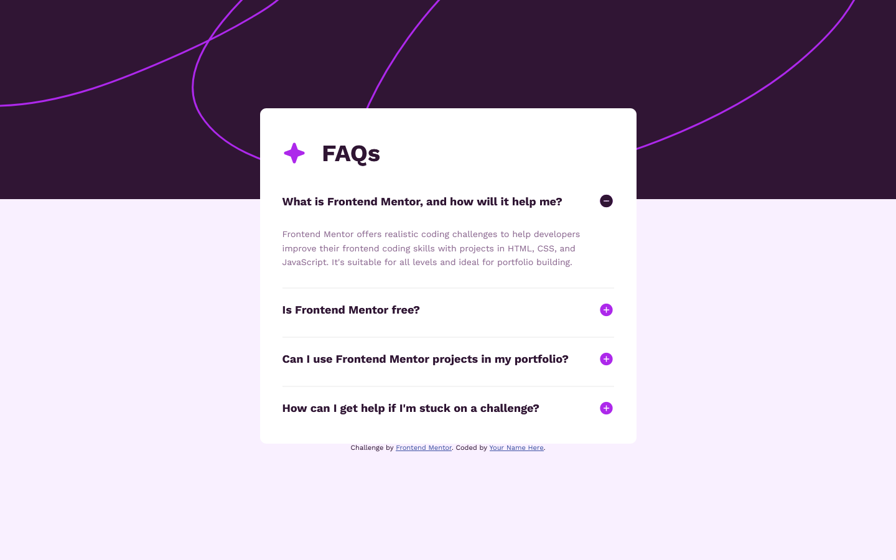
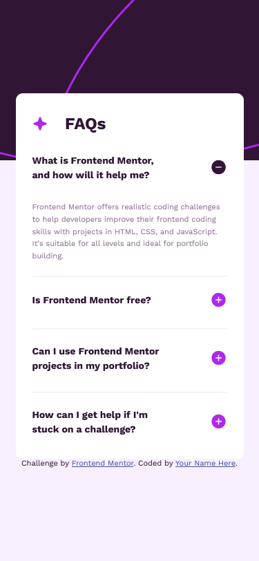

# Frontend Mentor - FAQ accordion


## Deploying your project

As mentioned above, there are many ways to host your project for free. Our recommend hosts are:

- [GitHub Pages](https://pages.github.com/)
- [Vercel](https://vercel.com/)
- [Netlify](https://www.netlify.com/)

## Got feedback for us?

We love receiving feedback! We're always looking to improve our challenges and our platform. So if you have anything you'd like to mention, please email hi[at]frontendmentor[dot]io.

# Frontend Mentor - FAQ accordion solution

This is a solution to the [FAQ accordion challenge on Frontend Mentor](https://www.frontendmentor.io/challenges/faq-accordion-wyfFdeBwBz). Frontend Mentor challenges help you improve your coding skills by building realistic projects. 

## Table of contents

- [Overview](#overview)
  - [The challenge](#the-challenge)
  - [Screenshot](#screenshot)
  - [Links](#links)
- [My process](#my-process)
  - [Built with](#built-with)
  - [What I learned](#what-i-learned)
  - [Continued development](#continued-development)
  - [Useful resources](#useful-resources)
- [Author](#author)

## Overview
- El reto de preguntas y respuestas tipo acordeón, es complicado cuando se hace sin javascript. Menos mal que hay una etiqueta HTML (details) que facilita el trabajo. 
### The challenge

Users should be able to:

- En este caso los elementos interactivos tipo hover, focus u ocultos son complicados de imitar, por que, debemos hacer que se puedan realizar con las teclas del teclado. De nuevo, menos mal que el elemento HTML details
ya tiene un tabindex por defecto.

### Screenshot




### Links

- Solution URL: [solución acoordeón](https://github.com/juan-mentor/faq-accordion-main.git)
- Live Site URL: [lugar en vivo](https://juan-mentor.github.io/faq-accordion-main/)

## My process
- En este caso, una vez empecé por el HTML, me dí cuenta de que el código escrito no me valía. Así que decidí consultar en Mozilla MDN si había alguna etiqueta que me pudiera ayudar a solucionarlo (encontré details y summary).

- Después de probar su funcionamiento en otra ventana de VS code, me encontré con otro problema, este era, como intercambiar el icono de más por el de menos. Al principio lo intenté colocando las imágenes encerradas en una etiqueta label, para enlazarlas con la etiqueta input tipo checkbox y de esta forma cuando esté en el estado checked, intercambiar los iconos. Pero lamentablemente no funcionó.

- Por último y después de unas cuantas horas, me dí cuenta que cuando pulsaba en el más del acoordeón en las herramientas de desarrollo aparecía el atributo open en el HTML, por lo que me sirvió para intercambiar los iconos de más y menos.

- El resto del Css fue coser y cantar (es decir más sencillo).

### Built with

- Semantic HTML5 markup
- CSS custom properties
- Flexbox
- Mobile-first workflow

### What I learned

- He aprendido varias cosas
  - He descubierto las etiquetas HTML `details y summary`
  - El icono que aparece por defecto en details es personalizable.
  - Dentro de la etiqueta summary no podemos tener otras etiquetas que estén anidadas, porque no funcionará el acordeón.

```html
<summary>
    <h2>Título que es visible</h2>
    <div>
        
    </div>
    <!-- No funciona el acordeón -->
</summary>
```
- así funcionará bien.

```html
<summary>
    <h2>Título que es visible</h2>
    
    
    
    <!-- funciona el acordeón -->
</summary>   
```

### Continued development

- Me gustaría aprender javascript (las bases y su correcto uso.)

### Useful resources

- [Página MDN](https://developer.mozilla.org/es/docs/Web/HTML/Element/details) - Esto me ayudó a hacer el acordeón.


## Author

- Website - [Add your name here](https://www.your-site.com)
- Frontend Mentor - [@juan-mentor](https://www.frontendmentor.io/profile/juan-mentor)